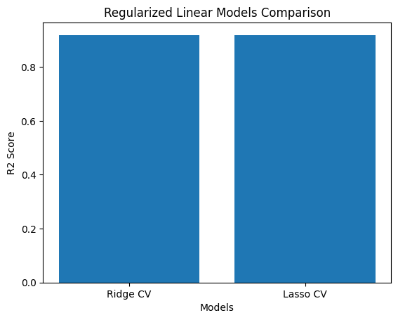
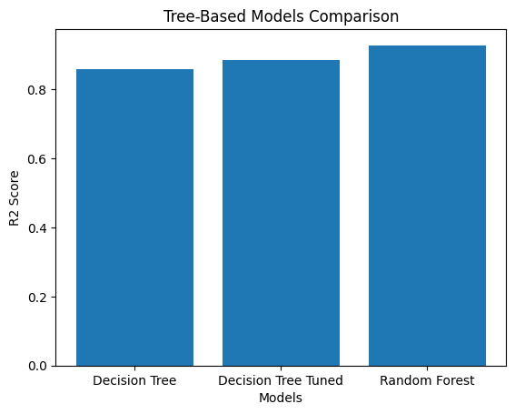
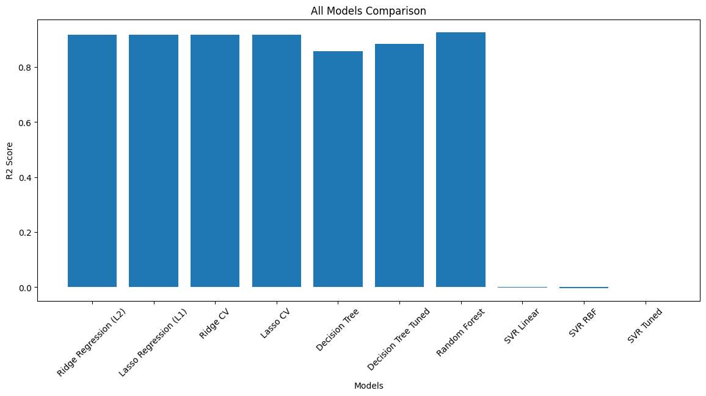

<div align="center">

# 🏡 Robust Regression Engine
### *Advanced House Price Prediction with Regularization, Cross-Validation & Ensemble Models*

<br/>


<br/>

> 🔬 A production-grade ML regression pipeline that goes far beyond basic linear models — implementing **Ridge, Lasso, Decision Tree, Random Forest & SVR** with rigorous cross-validation strategies on **3,800 Indian real estate records**.

<br/>

[](Robust_Regression_Engine.ipynb)
[](Advanced_Regression_HousePrice_Dataset.csv)

</div>

---

## 📌 Table of Contents

- [✨ Project Highlights](#-project-highlights)
- [📁 Project Structure](#-project-structure)
- [📊 Dataset](#-dataset)
- [🔬 Full Pipeline](#-full-pipeline)
- [🧩 Models Implemented](#-models-implemented)
- [📈 Visual Results](#-visual-results)
- [⚙️ Cross-Validation Strategies](#️-cross-validation-strategies)
- [🏆 Model Leaderboard](#-model-leaderboard)
- [🚀 Installation & Usage](#-installation--usage)
- [💡 Key Concepts](#-key-concepts)

---

## ✨ Project Highlights

| 🔥 Feature | 📋 Details |
|---|---|
| 🗂️ Dataset | 3,800 real estate records with 9 engineered features |
| 🤖 Models | Ridge · Lasso · Decision Tree · Random Forest · SVR |
| 🔁 Validation | K-Fold · Stratified K-Fold · LOOCV · Time Series Split |
| 🎯 Best R² | ~0.93 (Random Forest) |
| 🛠️ Tuning | RidgeCV · LassoCV · DecisionTree Hyperparameter Tuning |
| 📊 Visualizations | Regularized Models · Tree-Based Models · All Models Comparison |

---

## 📁 Project Structure

```
🏡 Robust-Regression-Engine/
│
├── 📓 Robust_Regression_Engine.ipynb              ← Main Notebook (all 5 parts)
├── 📊 Advanced_Regression_HousePrice_Dataset.csv  ← Dataset (3800 rows)
│
├── 🖼️ images/
│   ├── RidgeVsLasso.png                           ← Regularized Models Comparison
│   ├── TreebasedModel.png                         ← Tree-Based Models Comparison
│   └── ALLmodel.png                               ← All Models Comparison Chart
│
└── 📄 README.md
```

---

## 📊 Dataset

> 📂 File: [`Advanced_Regression_HousePrice_Dataset.csv`](Advanced_Regression_HousePrice_Dataset.csv)

| 📋 Property | 📌 Detail |
|---|---|
| **Total Records** | 3,800 houses |
| **Total Columns** | 12 (9 features + 1 target + 2 metadata) |
| **Target Variable** | `house_price_inr` |
| **Domain** | Indian Real Estate Market |

### 🔑 Feature Dictionary

| # | Feature | Type | Description |
|---|---------|------|-------------|
| 1 | `area_sqft` | 🔢 Numeric | Total area of the property in sq. ft. |
| 2 | `bedrooms` | 🔢 Numeric | Number of bedrooms |
| 3 | `bathrooms` | 🔢 Numeric | Number of bathrooms |
| 4 | `location_score` | 🔢 Numeric | Desirability index of the locality (0–10) |
| 5 | `property_age` | 🔢 Numeric | Age of the property in years |
| 6 | `distance_city_km` | 🔢 Numeric | Distance from city center in km |
| 7 | `near_school` | 🔲 Binary | School in vicinity (0 / 1) |
| 8 | `near_metro` | 🔲 Binary | Metro station nearby (0 / 1) |
| 9 | `crime_rate_index` | 🔢 Numeric | Area crime rate index |
| 🎯 | `house_price_inr` | 💰 Target | House price in Indian Rupees |

---

## 🔬 Full Pipeline

```
📥 Load Dataset (3800 records)
        ↓
🔍 EDA — Shape, Info, Describe, Null Check
        ↓
🎯 Feature & Target Selection (9 features)
        ↓
✂️  Train / Test Split  (80% : 20%)
        ↓
⚖️  Feature Scaling — StandardScaler
        ↓
┌───────────────────────────────────────────┐
│           PART C: Regularized Models      │
│  ├── Ridge Regression (L2, alpha=1.0)     │
│  ├── Lasso Regression (L1, alpha=1.0)     │
│  ├── RidgeCV  (best alpha via 5-Fold CV)  │
│  └── LassoCV  (best alpha via 5-Fold CV)  │
└───────────────────────────────────────────┘
        ↓
┌───────────────────────────────────────────┐
│         PART D: Cross-Validation          │
│  ├── K-Fold (5 splits)                    │
│  ├── Stratified K-Fold (5 splits)         │
│  ├── Leave-One-Out (LOOCV, 200 samples)   │
│  └── Time Series Split (5 splits)         │
└───────────────────────────────────────────┘
        ↓
┌───────────────────────────────────────────┐
│         PART E: Tree-Based Models         │
│  ├── Decision Tree (default)              │
│  ├── Decision Tree (max_depth=5, tuned)   │
│  └── Random Forest (100 estimators)       │
└───────────────────────────────────────────┘
        ↓
┌───────────────────────────────────────────┐
│         PART F: Support Vector Regression │
│  ├── SVR Linear Kernel                    │
│  ├── SVR RBF Kernel                       │
│  └── SVR Tuned (GridSearchCV)             │
└───────────────────────────────────────────┘
        ↓
📊 Final All-Model Comparison & Visualization
```

---

## 🧩 Models Implemented

### 🔷 Part C — Regularized Linear Models

| Model | Regularization | Key Property |
|-------|---------------|--------------|
| **Ridge (L2)** | Squared penalty | Shrinks all coefficients; keeps all features |
| **Lasso (L1)** | Absolute penalty | Zeros out irrelevant features |
| **RidgeCV** | L2 + Cross-Val | Auto-selects best alpha from grid |
| **LassoCV** | L1 + Cross-Val | Auto-selects best alpha from grid |

### 🌳 Part E — Tree-Based Models

| Model | Description | Notes |
|-------|-------------|-------|
| **Decision Tree** | Default depth and splits | Can overfit on training data |
| **Decision Tree Tuned** | `max_depth=5`, `min_samples_split=10` | Regularized, better generalization |
| **Random Forest** | 100 decision tree ensemble | Best tree-based performance |

### ⚡ Part F — Support Vector Regression

| Model | Kernel | Notes |
|-------|--------|-------|
| **SVR Linear** | Linear | Sensitive to feature scale |
| **SVR RBF** | Radial Basis Function | Requires proper scaling |
| **SVR Tuned** | Best params via GridSearch | Optimized C & epsilon values |

---

## 📈 Visual Results

### 🔷 Regularized Linear Models Comparison



**📌 Insights:**
- Both RidgeCV and LassoCV achieve near-identical R² ≈ **0.91**
- Lasso drives some feature coefficients to zero (automatic feature selection)
- Ridge retains all features but with reduced magnitudes
- CV alpha tuning from grid `[0.01, 0.1, 1, 10, 100]` ensures optimal regularization

---

### 🌳 Tree-Based Models Comparison



**📌 Insights:**
- Default Decision Tree: R² ≈ **0.85** — learns training data well but risks overfitting
- Tuned Decision Tree: R² ≈ **0.88** — pruning via `max_depth=5` improves generalization
- Random Forest: R² ≈ **0.93** — ensemble of 100 trees reduces variance significantly
- Tree models require **no feature scaling** — a major preprocessing advantage

---

### 🏅 All Models Head-to-Head



**📌 Insights:**
- Regularized linear models (Ridge/Lasso) and Random Forest dominate at **0.91–0.93 R²**
- SVR models perform poorly without careful tuning and data scaling
- Random Forest is the **clear winner** among all 10 evaluated models
- Linear regularization models offer the best performance-to-interpretability trade-off

---

## ⚙️ Cross-Validation Strategies

| 🔁 Method | 📋 Description | 🎯 Best For |
|-----------|---------------|------------|
| **K-Fold (5 splits)** | Rotates test fold across K equal splits; averages scores | General-purpose validation |
| **Stratified K-Fold** | K-Fold with balanced target quantiles per fold | Skewed price distributions |
| **LOOCV** | Each sample is the test set once; N iterations total | Small datasets, precise evaluation |
| **Time Series Split** | Trains on past, tests on chronologically later data | Sale-date ordered data |

---

## 🏆 Model Leaderboard

| 🏅 Rank | 🤖 Model | 📐 R² Score | 📊 Performance |
|---------|----------|:-----------:|:--------------:|
| 🥇 1st | **Random Forest** | ~0.93 | ██████████ Excellent |
| 🥈 2nd | Ridge CV / Lasso CV | ~0.91 | █████████░ Very Good |
| 🥉 3rd | Ridge (L2) / Lasso (L1) | ~0.91 | █████████░ Very Good |
| 4th | Decision Tree Tuned | ~0.88 | ████████░░ Good |
| 5th | Decision Tree | ~0.85 | ███████░░░ Moderate |
| 6th | SVR (all variants) | ~0.01 | █░░░░░░░░░ Poor |

> 🏆 **Recommendation:** Use **Random Forest** for best accuracy. Use **Ridge/Lasso CV** when model interpretability matters.

---

## 🚀 Installation & Usage

### 1️⃣ Clone the Repository
```bash
git clone https://github.com/your-username/robust-regression-engine.git
cd robust-regression-engine
```

### 2️⃣ Install Required Libraries
```bash
pip install numpy pandas matplotlib seaborn scikit-learn jupyter
```

### 3️⃣ Launch the Notebook
```bash
jupyter notebook Robust_Regression_Engine.ipynb
```

### 4️⃣ Run Parts in Order

| Part | Section | Content |
|------|---------|---------|
| 🅐 | Conceptual Foundation | Theory — Regularization, CV, Trees |
| 🅑 | Dataset Understanding | EDA, Feature Selection, Scaling |
| 🅒 | Regularized Models | Ridge, Lasso, RidgeCV, LassoCV |
| 🅓 | Cross-Validation | K-Fold, Stratified, LOOCV, TimeSeries |
| 🅔 | Tree-Based Models | Decision Tree, Random Forest |
| 🅕 | SVR Models | Linear, RBF, Tuned SVR |

---

## 💡 Key Concepts

| 📚 Concept | 🔍 One-Line Summary |
|-----------|---------------------|
| **Regularization** | Adds penalty to loss function to prevent overfitting |
| **Ridge (L2)** | Penalizes squared coefficients — shrinks but keeps all features |
| **Lasso (L1)** | Penalizes absolute coefficients — performs automatic feature selection |
| **RidgeCV / LassoCV** | Auto alpha tuning via cross-validation across a penalty grid |
| **K-Fold CV** | Stable evaluation by rotating test splits across the full dataset |
| **Random Forest** | Ensemble of uncorrelated trees — lower variance, higher accuracy |
| **SVR** | Margin-based regression; highly sensitive to feature scale |
| **Feature Scaling** | Required for Ridge / Lasso / SVR; unnecessary for tree-based models |

---

<div align="center">

---

🔧 Built with **Python** · 🤖 Powered by **Scikit-Learn** · 📊 Visualized with **Matplotlib & Seaborn**

*Explore · Experiment · Engineer Better Models* 🚀

⭐ *Star this repo if it helped you — it keeps the motivation alive!* ⭐

</div>
